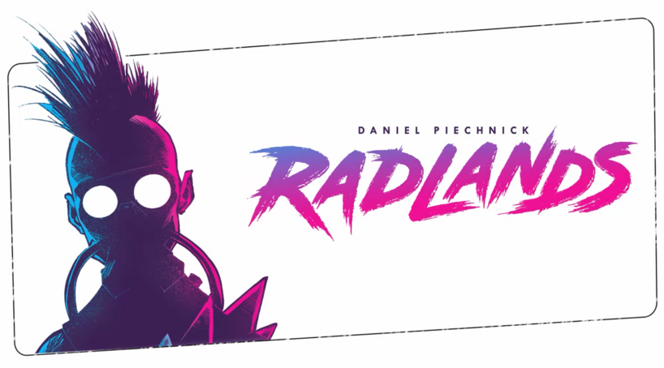

# Radlands (Digital Implementation)

A digital version of the tactical two-player card game **Radlands**, where players duel to protect their camps and deplete their opponent's resources.

## Table of Contents

- [Overview](#overview)
- [Gameplay](#gameplay)
- [Installation](#installation)
- [Running](#running)
- [License](#license)

## Overview

**Radlands** is a card-based strategy game set in a post-apocalyptic world. Players use limited resources (water) to protect their camps and deploy cards (people and events) to attack their opponent's camps. The objective is to destroy the opponent's three camps while managing your own.

## Gameplay

- **Players**: 2
- **Objective**: Destroy your opponent's three camps before they destroy yours.
- **Resources**: Water, used to play cards and activate special abilities.
- **Camps**: Players start with three camps, each providing different abilities.
- **Cards**: Cards represent **people** (to protect your camps or attack) and **events** (to trigger powerful effects). Each card costs a certain amount of water.

## Installation

### Prerequisites

- [Rust](https://www.rust-lang.org/) (for building the game)
- [Bevy](https://bevyengine.org/) (game engine)

Clone this repository a:

```bash
git clone https://github.com/yourusername/radlands-digital.git
cd radlands-digital
```

### Dependencies

To install dependencies, run:

```bash
cargo build
```

## Running 

To run the game locally:

```bash
cargo watch -x "run"
```


## License

This project is licensed under the MIT License.
